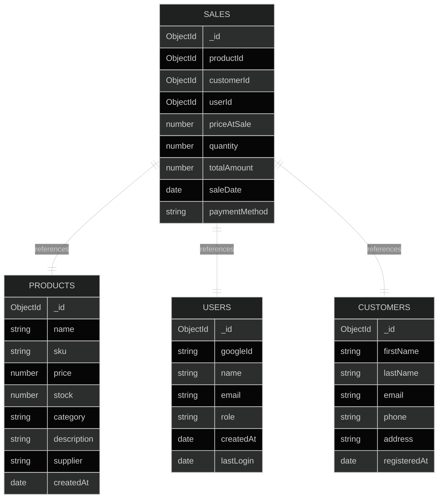

```mermaid
%%{init: {'theme': 'dark'}}%%
%% Database: posdb
erDiagram
    USERS {
        ObjectId _id
        string googleId
        string name
        string email
        string role
        date createdAt
        date lastLogin
    }

    PRODUCTS {
        ObjectId _id
        string name
        string sku
        number price
        number stock
        string category
        string description
        string supplier
        date createdAt
    }

    SALES {
        ObjectId _id
        ObjectId productId
        ObjectId customerId
        ObjectId userId
        number priceAtSale
        number quantity
        number totalAmount
        date saleDate
        string paymentMethod
    }

    CUSTOMERS {
        ObjectId _id
        string firstName
        string lastName
        string email
        string phone
        string address
        date registeredAt
    }

    SALES ||--|| PRODUCTS : "references"
    SALES ||--|| USERS : "references"
    SALES ||--|| CUSTOMERS : "references"


```
